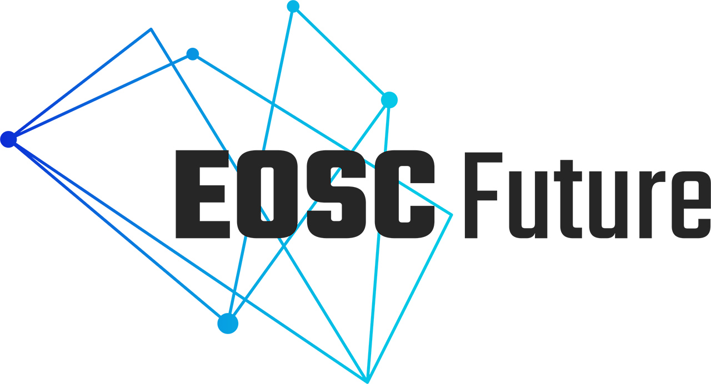

# GOCDB

Grid Operations Configuration Management Database. A Repository, Portal and REST style API for managing Grid and Cloud topology objects including; projects, administrative domains, sites, services, service-endpoints, service-groups, downtimes, users, roles and business rules.

  
  
  
  
  

GOCDB is provided by [STFC](https://stfc.ukri.org/), part of [UK Research and Innovation](https://www.ukri.org/), and is co-funded by [EGI](https://egi.eu) via [EGI-ACE](https://www.egi.eu/project/egi-ace/), [EOSC-Future](https://eoscfuture.eu/) and the [IRIS](https://www.iris.ac.uk/) community.

Licensed under the [Apache 2 License](https://www.apache.org/licenses/LICENSE-2.0).

## Documentation

* [GOCDB Executive Summary](https://wiki.egi.eu/w/images/d/d3/GOCDB5_Grid_Topology_Information_System.pdf)
* [EGI GOCDB wiki landing page](https://wiki.egi.eu/wiki/GOCDB)
* [GOCDB Documentation index](https://wiki.egi.eu/wiki/GOCDB_Documentation_Index)
* [User documentation](https://wiki.egi.eu/wiki/GOCDB/Input_System_User_Documentation)
* [INSTALL.md](INSTALL.md) for installation
