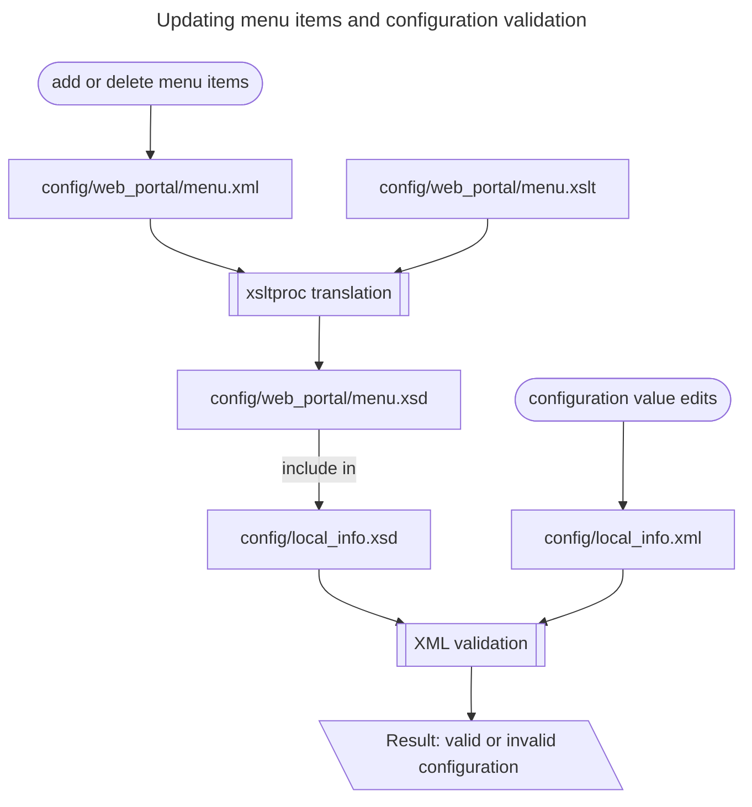

## What *config/web_portal/menu.xsd* is for.

This file is the schema file for the definiton of GOCDB's left-hand column menu, used to check that only valid menu names are included in the GOCDB main configuration file config/local_info.xml. The menu.xsd file is built automatically, **do not edit it** - see the next question.

GOCDB uses an XML definition (config/web_portal/menu.xml) to programatically draw the left-hand menu items on the user
interface. Which menu items are drawn is selected via the \<MENU> element in the GOCDB configuration file (config/local_info.xml). To check that only valid menu item names are given within the \<MENU> element it is necessary to generate an XML schema containing all valid menu names (config/web_portal/menu.xsd).

## What *config/web_portal/menu.xslt* is for.

This file is the transformation file which builds the menu.xsd schema definition file - see the previous question - from the menu definition file config/web_portal/menu.xml.

To avoid having to specify menu names manually twice: once in the XML and once in the schema definition (config/local_info.xsd), an XSL Transformation file (config/web_portal/menu.xslt) is used to generate the menu schema (config/web_portal/menu.xsd) directly from the XML menu file. This menu schema is then included into the overall GOCDB schema when the configuration is validated.

## How to make changes made to the left-hand menu.

Left-hand menu items can be added or deleted by editing the menu XML file (config/web_portal/menu.xml). You should then run the XSL Transformation processor command *xsltproc* to generate a new menu schema -
```
xsltproc -o menu.xsd menu.xslt menu.xml
```
The resulting .xsd file will automatically be included in the configuration validation.

## Why these files are used.

To prevent misstypes and other difficult-to-spot configuration errors, GOCDB uses an XML schema file (config/local_info.xsd) to validate the XML elements given in the main configuration file (config/local_info.xml).

## How these files are used.

Checking that the schema is correct is done as part of the operations monitoring tests (htdocs/web_portal/GOCDB_monitor/*).

An XSLT translation file is not used to build the main configuration schema file (config/local_info.xsd) because the menu XML is part of the codebase, whereas the main configuration XML is variable content to be validated against the main schema definition which is also part of the codebase.


